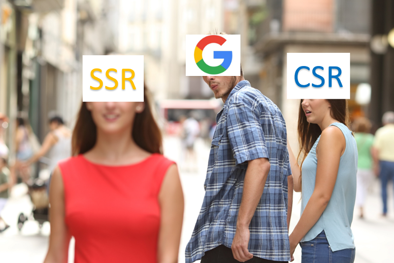

## 1. TCP와 UDP의 페이로드는 동일한데 UDP가 왜 빠를까?
TCP는 안정성을 보장하고 UDP는 안정성은 보장하지 않지만, 속도는 빠르다. 
이 내용은 TCP와 UDP를 접해봤던 사람이라면 누구나 알고 있는 사실이다. 

하지만 _"왜 UDP가  빠를까?"_ 에 대한 고민은 크게 해보지 않았던 것 같다. 

어렴풋이 알고는 있지만 자신있게 설명은 못 할 것 같다는 생각이 들어 해당 내용에 대해서 찾아보았다.

TCP(Transmission Control Protocol) 는 불안정한 IP(Internet Protocol) 위에서 안정적인 패킷 전송을 위해 탄생하게 된 전송 제어 프로토콜이다. 여기서 안정성을 보장해주는 것은 ACK와 타임아웃, 그리고 재전송이다. (3-hand-shaking)
 이 안정성을 보장해주기 위해 TCP 비용을 지불해야하고 상대적으로 복잡한 절차들을 거처야 패킷이 성공적으로 전송되기 문에 속도가 느린 것이다.
 그런데 만약 TCP 전송이 패킷 유실 없이 순조롭다고 가정을 한다면 결국에는 UDP와 동일한 속도를 낼 수 있지 않을까 생각이 든다. 찾아보니 TCP는 네트워크의 체증을 컨트롤 하기 위해서 한 번에 보낼 수 있는 패킷의 개수가 정해져 있다고 한다. (그 이외에도 느린 이유가 많음...)

UDP(User Datagram Protocol) 는 IP(Internet Protocol)와 거의 흡사하다. 즉, 하는 일이 거의 없다고 생각하면 된다. TCP의 구색을 추기 위해 나온 껍데기에 불과하다. 그래서 IP와 동일하게 잘 전달이 되었든 안 되었든 전송하고 바로 끝이 난다. (불안정함)

결론적으로 UDP가 빠르다는 것은 최적의 경로를 따라가서 빠르다는 의미가 아니고 TCP보다 상대적으로 비용이 적기 때문에 빠를 수밖에 없는 것이다.

추가로 _"UDP의 속도와 TCP의 안정성의 타협점을 찾아서 각각의 장점을
 취하면 안 될까?"_ 하는 생각에 탄생한 Reliable UDP라는 것이 있다고 한다. 
 
 그럼 무조건 Reliable UDP가 좋은 것일까? 그건 아닐 것이다. 

**TCP와 UDP는 안정성과 속도라는 트레이드 오프의 결과인 만큼 무시할 수 없다.**

## 2. Linked List와 Array 비교
두 자료구조 모두 유사한 linear data를 저장하지만 서로 장단점이 있다.
 개발하면서 자주 쓰는 자료구조이고 어렴풋이 알던 내용을 간단히 정리하고 싶었다. 

|          |LinkedList                           | Array                    |
|:---------|:------------------------------------|:-------------------------|
| 검색     | Sequential Access - O(n)            | Random Access - O(1)     |
| 연산     | 사용가능 한 빈 memory 위치에 저장 비용이 적어 연산이 빠름 | 연속적이고 비용이 크기 때문에 연산이 느림                     |
| 메모리   | Dymamic Memory Allocation (runtime) | Static Memory Allocation (complie time)|

## 3. NOT IN vs NOT EXIST 어느 것이 더 빠를까
[stackoverflow](https://stackoverflow.com/questions/173041/not-in-vs-not-exists)

## 4. SSR과 CSR 그리고 SEO

Server Side Rendering, Client Side Rendering 단어 그대로 server에서 rendering을 하냐 client에서 rendering을 하느냐의 차이다. 최근 SNS나 커뮤니티에서 키워드가 자주 보여서 간단히 정리를 하였다.

SSR은 전통적인 렌더링 방식이다. 모든 페이지의 리소스는 서버에 저장되어 있으며 HTML이 다운로드 되고 JS및 CSS 등 static한 파일들이 다운로드가 된다. 그리고 최종 랜더링되어 사용자나 봇에게 보여주게 된다.

CSR은 SSR에 비해 비교적 최근에 나온 방식인데 클라이언트 측에서 실행되는 JS코드에 의존한다. 클라이언트는 최소한의 HTML을 내려받은 뒤 두 번째로  HTML을 포함하고 있는 JS를 요청하여 랜더링 하게된다. (React, Vue 등)

글만 읽었을 때는 도대체 그래서 뭐가 다른가 의아할 수도 있다. 비유하여 설명하면 더 이해가 쉬울 것 같다.

> With server-side rendering, whenever you want to see a new web page, you have to go out and get it, this is analogous to you driving over to the super market every time you want to eat. With client-side rendering, you go to the super market once and spend 45 minutes walking around buying a bunch of food for the month. Then, whenever you want to eat, you just open the fridge.” — Adam Zerner

그래서 요즘은 최초로딩이 조금 느리더라도(거의 차이가 없다고 생각함..) SSR으로 제공하여  더 나은 사용자 경험을 택하고 있다. 그러나 여기에는 문제점이 하나 있다. SSR에서의 JS는 이미 소스 코드에 있는 HTML 컨텐츠를 조작만 하므로 검색엔진이 컨텐츠를 발견하고 색인하는데는 문제가 없었다.  CSR에서는 웹 페이지의 컨텐츠가 비어있고 JS실행으로 컨텐츠가 생성되기 때문에 검색엔진이 발견할 수 없다는 것이다. (SEO 문제)

그럼 이에 대한 해결안은..? 

1. Pre-rendering
2. Isomoraphic Javascript

다음주에 찾아야겠다...

###### 참고
* [http://www.inven.co.kr/webzine/news/?news=165870](http://www.inven.co.kr/webzine/news/?news=165870)
* [https://opentutorials.org/module/1335/8636](https://opentutorials.org/module/1335/8636)
* [https://www.geeksforgeeks.org/linked-list-vs-array/](https://www.geeksforgeeks.org/linked-list-vs-array/)
* [https://medium.com/@audrl1010/linked-list-와-array-차이점-4ba873c2e5f5](https://medium.com/@audrl1010/linked-list-와-array-차이점-4ba873c2e5f5)
* [https://medium.com/@benjburkholder/javascript-seo-server-side-rendering-vs-client-side-rendering-bc06b8ca2383](https://medium.com/@benjburkholder/javascript-seo-server-side-rendering-vs-client-side-rendering-bc06b8ca2383)
